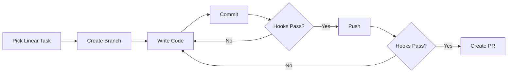
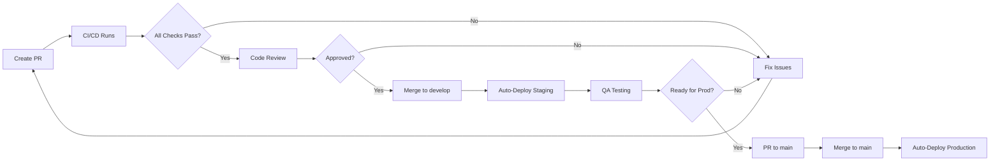

# KOMPASS Deployment Documentation

**Welcome to the KOMPASS CI/CD and Deployment documentation!**

---

## 🚀 Quick Navigation

### I Want To...

**...set up the CI/CD pipeline for the first time**
→ Start with [QUICK_START.md](./QUICK_START.md) (30 minutes)

**...understand the complete workflow**
→ Read [DEPLOYMENT_GUIDE.md](./DEPLOYMENT_GUIDE.md) (1 hour)

**...configure GitHub secrets**
→ See [GITHUB_SECRETS.md](./GITHUB_SECRETS.md) (Reference guide)

**...deploy to staging/production**
→ See [DEPLOYMENT_GUIDE.md](./DEPLOYMENT_GUIDE.md) (Automated via GitHub Actions)

**...rollback a failed deployment**
→ See [ROLLBACK_PROCEDURES.md](./ROLLBACK_PROCEDURES.md) (Emergency guide)

**...understand the developer workflow**
→ Read [../processes/DEVELOPMENT_WORKFLOW.md](../processes/DEVELOPMENT_WORKFLOW.md)

**...use the setup checklist**
→ Follow [SETUP_CHECKLIST.md](./SETUP_CHECKLIST.md) (Step-by-step)

---

## 📚 Document Index

| Document | Purpose | Audience | Time to Read |
|----------|---------|----------|--------------|
| [QUICK_START.md](./QUICK_START.md) | Fast setup guide | DevOps, Tech Lead | 30 min |
| [SETUP_CHECKLIST.md](./SETUP_CHECKLIST.md) | Step-by-step checklist | DevOps, Tech Lead | 2-4 hours |
| [DEPLOYMENT_GUIDE.md](./DEPLOYMENT_GUIDE.md) | Complete deployment reference | DevOps, Developers | 1 hour |
| [GITHUB_SECRETS.md](./GITHUB_SECRETS.md) | Secrets reference | DevOps, Security | 30 min |
| [ROLLBACK_PROCEDURES.md](./ROLLBACK_PROCEDURES.md) | Emergency rollback guide | DevOps, On-call | 15 min |
| [IMPLEMENTATION_COMPLETE.md](./IMPLEMENTATION_COMPLETE.md) | Implementation summary | Tech Lead | 20 min |

---

## 🎯 What Has Been Implemented

### Complete CI/CD Pipeline

✅ **Docker Infrastructure**
- Production-ready Dockerfiles (backend + frontend)
- Multi-stage builds for minimal image sizes
- Security hardening (non-root users, minimal base images)
- docker-compose for all environments

✅ **Quality Gates**
- 11 automated checks on every PR
- Unit, integration, and E2E tests
- Linting, formatting, type checking
- Security scanning (Snyk, Semgrep)
- Test coverage enforcement (≥75%)

✅ **Documentation Automation**
- Automatic documentation validation
- API docs generation from code
- Changelog generation from commits
- Broken link detection

✅ **Deployment Automation**
- Auto-deploy to staging on merge to `develop`
- Auto-deploy to production on merge to `main`
- Comprehensive health checks
- Automatic rollback on failure
- GitHub release creation

✅ **Git Workflow Integration**
- Linear issue tracking enforced
- Conventional commits required
- Branch naming validation
- Pre-commit and pre-push hooks

✅ **Safety Features**
- Automatic rollback scripts
- Database backups
- Health monitoring
- Deployment logs and audit trail

---

## 🏃 Quick Start Path

**For First-Time Setup** (Choose one):

### Path A: Fast Track (2 hours)
1. Read [QUICK_START.md](./QUICK_START.md)
2. Follow [SETUP_CHECKLIST.md](./SETUP_CHECKLIST.md)
3. Test deployment

### Path B: Comprehensive (4 hours)
1. Read [IMPLEMENTATION_COMPLETE.md](./IMPLEMENTATION_COMPLETE.md)
2. Read [DEPLOYMENT_GUIDE.md](./DEPLOYMENT_GUIDE.md)
3. Configure servers following guide
4. Configure GitHub secrets from [GITHUB_SECRETS.md](./GITHUB_SECRETS.md)
5. Test complete workflow

**Recommendation**: Start with Path A, refer to Path B docs as needed

---

## 📋 Pre-Setup Requirements

Before you begin, ensure you have:

### Access & Accounts
- [ ] GitHub repository admin access
- [ ] Two servers with root SSH access (staging + production)
- [ ] Snyk account (free tier sufficient)
- [ ] (Optional) Domain names configured

### Local Requirements
- [ ] Git installed and configured
- [ ] SSH client
- [ ] Text editor
- [ ] Terminal/command line access

### Knowledge Requirements
- Basic Linux command line
- Basic Docker concepts
- Basic Git workflow
- SSH key management

**Don't have these?** Follow the relevant sections in [DEPLOYMENT_GUIDE.md](./DEPLOYMENT_GUIDE.md)

---

## 🔄 The Complete Workflow

### Developer Creates Feature

### PR to Deployment

**Timeline**:
- PR creation to merge: 1-2 hours (with review)
- Staging deployment: ~15 minutes
- Production deployment: ~20 minutes

**Total**: Feature to production in 2-3 hours

---

## 🛡️ Quality Gates

Every PR must pass **13 checks**:

### Automated (11 checks)
1. ESLint (code quality)
2. TypeScript (type safety)
3. Prettier (formatting)
4. Unit tests (70% of pyramid)
5. Integration tests (20% of pyramid)
6. E2E tests (10% of pyramid)
7. Build verification
8. Security audit
9. Documentation validation
10. Commit message format
11. Branch naming convention

### Manual (2 checks)
12. Code review (1+ approval)
13. Conversation resolution

**All must pass before merge is allowed**

---

## 🎓 Learning Resources

### For Developers
1. Read: [Development Workflow](../processes/DEVELOPMENT_WORKFLOW.md)
2. Practice: Create a test PR following the workflow
3. Reference: Keep workflow guide handy

### For DevOps
1. Read: [Quick Start](./QUICK_START.md)
2. Read: [Deployment Guide](./DEPLOYMENT_GUIDE.md)
3. Practice: Deploy to staging
4. Test: Perform rollback on staging

### For Team Leads
1. Read: [Implementation Complete](./IMPLEMENTATION_COMPLETE.md)
2. Review: Quality gates and their rationale
3. Train: Team members on workflow

---

## 🆘 Troubleshooting

### Common Issues

| Issue | Quick Fix | Full Solution |
|-------|-----------|---------------|
| Commit hooks fail | Run `pnpm lint --fix && pnpm format` | See Development Workflow |
| CI checks fail | Check GitHub Actions logs | Fix and push again |
| Deployment fails | Check GitHub secrets | See Deployment Guide |
| Services won't start | Check logs: `docker-compose logs` | See Deployment Guide |
| Need to rollback | Run `bash scripts/rollback.sh` | See Rollback Procedures |

**Full troubleshooting**: See [DEPLOYMENT_GUIDE.md](./DEPLOYMENT_GUIDE.md#troubleshooting)

---

## 📞 Support

### Documentation Issues
- Create issue with tag: `documentation`
- Update docs and submit PR

### Deployment Issues
- Check: [DEPLOYMENT_GUIDE.md](./DEPLOYMENT_GUIDE.md)
- Rollback: [ROLLBACK_PROCEDURES.md](./ROLLBACK_PROCEDURES.md)
- Create Linear issue with tag: `ci-cd` or `deployment`

### Emergency Production Issues
- Follow: [ROLLBACK_PROCEDURES.md](./ROLLBACK_PROCEDURES.md)
- Contact: DevOps on-call

---

## 🗺️ Deployment Environments

| Environment | URL | Branch | Deploy Trigger | Purpose |
|------------|-----|--------|----------------|---------|
| Development | localhost:3000 | Any | Manual | Local development |
| Staging | staging.kompass.de | develop | Auto on merge | QA testing |
| Production | kompass.de | main | Auto on merge | Live system |

---

## 📊 Metrics & Monitoring

After deployment, monitor:

- **Build Time**: Target <10 minutes
- **Deployment Time**: Target <15 minutes (staging), <20 minutes (production)
- **Test Success Rate**: Target >95%
- **Deployment Success Rate**: Target >98%
- **Rollback Time**: Target <5 minutes

**Dashboard**: GitHub repository Insights → Actions

---

## 🔄 Maintenance Schedule

### Weekly
- Review GitHub Actions logs
- Check deployment health
- Review pending PRs

### Monthly
- Review test coverage
- Update dependencies
- Review security scans

### Quarterly
- Rotate secrets and credentials
- Review documentation
- Update deployment procedures
- Security audit

---

## 📖 Related Documentation

### Core Documentation
- [Architecture](../architecture/)
- [API Specification](../specifications/API_SPECIFICATION.md)
- [RBAC Permissions](../specifications/RBAC_PERMISSION_MATRIX.md)

### Process Documentation
- [Development Workflow](../processes/DEVELOPMENT_WORKFLOW.md)
- [Git Workflow](../../.cursor/rules/git-workflow.mdc)
- [Code Review Standards](../../.cursor/rules/code-review-standards.mdc)

---

## ✨ What's Next?

After setup is complete:

1. **Train your team** - Share development workflow docs
2. **Create first real PR** - Follow the workflow
3. **Monitor deployments** - Watch first few deployments closely
4. **Gather feedback** - Improve based on team input
5. **Celebrate** - You have a production-ready CI/CD pipeline! 🎉

---

**Questions?** Create a Linear issue with the `ci-cd` tag.

**Ready to start?** Go to [QUICK_START.md](./QUICK_START.md)

